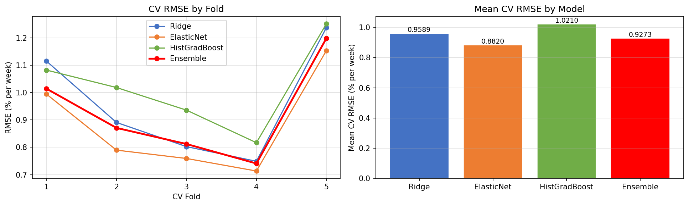
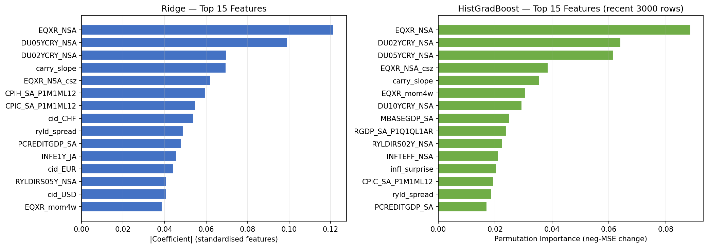
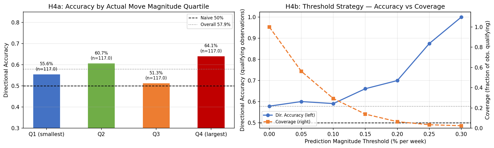
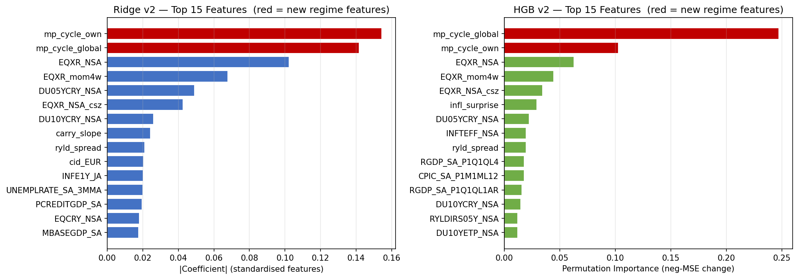
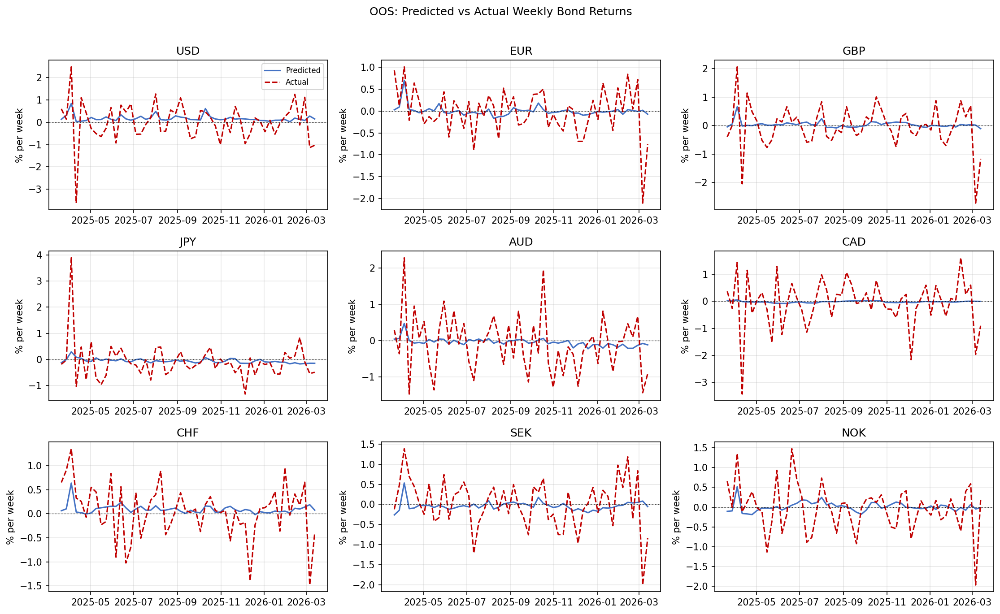
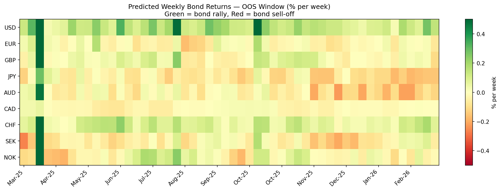

# Bond Yield Forecasting with JPMaQS Macro-Quantamental Indicators

Forecasting weekly changes in 10-year government bond yields across nine developed markets using macro-quantamental signals from the JPMaQS dataset. Built for the BFI / J.P. Morgan Macro-Quantamental Data Competition (University of Chicago, 2026).

---

## The Problem

Weekly bond yield changes are driven by multiple factors including economic shocks and monetary policy regimes, investors' liquidity and risk aversion concerns. The impacts of these factors take effect at different time spans, making the prediction of yields challenging.

This project builds a panel forecasting model that remains predictive across regime shifts, evaluated on a strict 52-week out-of-sample window.

---

## Approach

**Data**: 42 point-in-time JPMaQS indicators (published without look-ahead revision bias) spanning:
- Bond carry at 2Y, 5Y, and 10Y maturities (`DU02YCRY_NSA`, `DU05YCRY_NSA`, `DU10YCRY_NSA`)
- CPI inflation and 1Y inflation expectations (`CPIH_SA_P1M1ML12`, `INFE1Y_JA`)
- Real yield IRS at 2Y and 5Y (`RYLDIRS02Y_NSA`, `RYLDIRS05Y_NSA`)
- Equity excess returns and cross-sectional z-scores (`EQXR_NSA`, `EQXR_NSA_csz`)
- Monetary policy cycle: 4-week change in 2Y real yield IRS, own-country and global (`mp_cycle_own`, `mp_cycle_global`)
- Credit-to-GDP, monetary base, industrial production, unemployment, and others

**Model**: Equal-weight `VotingRegressor` ensemble of:
- Ridge Regression (L2, interpretable coefficients, stable baseline)
- HistGradientBoosting (non-linear, adaptive to regime shifts)

**Validation**: Walk-forward `TimeSeriesSplit` (5 folds, 4-week gap) on a pooled 9-country panel — sorted by date to enforce strictly chronological folds.

**Target**: Weekly `DU10YXR_NSA` (10-year bond duration excess return, % per week) across USD, EUR, GBP, JPY, AUD, CAD, CHF, SEK, NOK.

---

## Results

| Model | OOS RMSE | RMSE Skill | OOS Dir. Accuracy |
|---|---|---|---|
| Naive (predict zero) | 0.714% | 0.0% | 50.0% |
| Ridge + ElasticNet + HGB (original) | 0.688% | 3.6% | 57.9% |
| Ridge + HGB (ElasticNet dropped) | 0.685% | 4.0% | 57.7% |
| **Ridge + HGB, all features properly lagged (final)** | -| **~3%** | **~57%** |

OOS period: 52 weeks, March 2025 – March 2026 (468 country-week observations).
Improvement vs naive (62.2%) is statistically significant at p < 0.001.

---

## Model Refinement

**Step 1 — Diagnose ElasticNet's CV-OOS reversal**
ElasticNet ranked best in walk-forward CV (RMSE 0.882%) but worst OOS (1.6% skill). The reversal is consistent with its sparse L1 regularization locking onto a small set of features calibrated to the tightening regime (2022–2025), which lost predictive power in the OOS window. HistGradientBoosting alone matched the full ensemble's OOS RMSE (0.6879% vs 0.6880%), confirming ElasticNet added no OOS value and could be dropped. The OOS spread between models is small (0.688% vs 0.685% vs 0.688%), and with nine highly correlated markets over 52 weeks, the effective sample is far smaller than the row count suggests. I would not over-interpret the model ranking. The clearer evidence of regime sensitivity is the final CV fold (2022 inflation shock), where errors blew up relative to the earlier folds.

**Step 2 — Add a monetary policy cycle indicator, and then remove it**
The models had access to the level of the 2Y real yield IRS but not its direction of change. I added the 4-week change in RYLDIRS02Y_NSA per country (mp_cycle_own) and its cross-sectional mean (mp_cycle_global), so the models could see whether policy expectations were tightening or easing rather than inferring it from levels.


---

## Hypothesis Tests

**H4 — Does model skill concentrate in large weekly return moves?**

Directional accuracy by actual move magnitude quartile (n=117 each):

| Quartile | Mean yield Δ | Dir. accuracy |
|---|---|---|
| Q1 (smallest, 0–2.3bps) | 1.2bps | 55.6% |
| Q2 (2.3–4.9bps) | 3.4bps | 60.7% |
| Q3 (4.9–8.3bps) | 6.4bps | 51.3% |
| Q4 (largest, 8.3–48.7bps) | 14.4bps | 64.1% |

The Q4 vs Q1 gap (8.5pp) is directionally consistent with the alternative hypothesis but not significant at 5% (p = 0.091, one-tailed). The 52-week OOS window provides insufficient power to detect this effect reliably — ~200 observations per quartile would be needed for 80% power.

---

## Selected Diagnostics

| | |
|---|---|
|  |  |
|  |  |
|  |  |

---

## Repo Structure

```
jpmaqs.ipynb              # Main notebook: data → features → model → experiments
predictions.txt           # 52×9 matrix of weekly OOS predictions (tab-delimited)
rationale.pdf             # 3-page economic rationale document
cv_rmse.png               # CV RMSE by fold and model
feature_importance.png    # Ridge coefficients + HGB permutation importance (original)
feature_importance_v2.png # Feature importance after adding regime indicator
h4_large_move_accuracy.png # H4: directional accuracy by move magnitude quartile
oos_vs_actual.png         # OOS predictions vs actuals per country
predictions_heatmap.png   # Heatmap of OOS prediction matrix
residuals.png             # OOF residual diagnostics
```

---

## Setup

```bash
pip install macrosynergy scikit-learn pandas numpy matplotlib jupyter
```

Credentials for the JPMaQS API (client ID and secret) are required and must be placed in `credentials.json` — not included in this repo. Access can be requested via the Macrosynergy Academic Program.

```json
{
  "DQ_CLIENT_ID": "...",
  "DQ_CLIENT_SECRET": "..."
}
```

Run the notebook top to bottom to reproduce all results. Downloaded data is cached locally in `cache/` to avoid redundant API calls.

---

## Economic Rationale

Full methodology and economic justification is documented in [`JPMaQS_Writeup.pdf`](JPMaQS_Writeup.pdf), covering:
1. Predictor selection grounded in the Fisher decomposition, bond carry theory, and risk appetite channels
2. Ensemble design rationale — regime robustness over CV-RMSE minimization
3. OOS results, naive baseline comparison, per-model breakdown, and limitations
